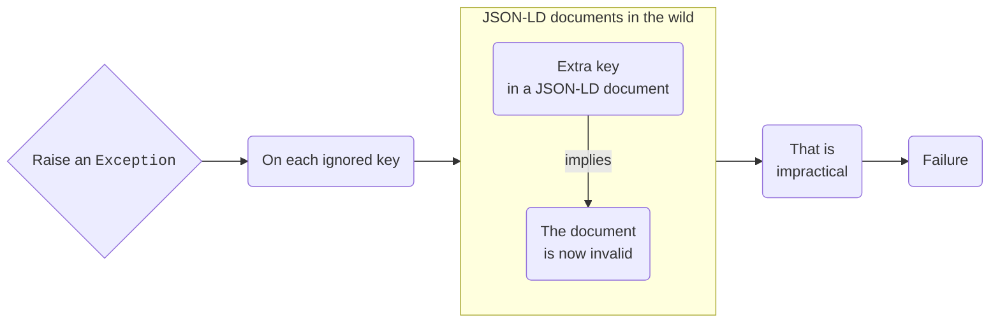
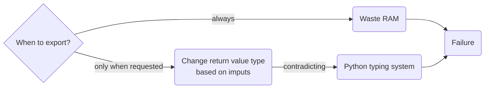

# Call a customizable handler when a key is ignored during JSON-LD expansion

## Context

If a key in a JSON-LD document does not map to an absolute IRI then it is ignored. This situation might be valuable to debugging, and silent ignoring is not too good.

Essentially, we need to provide the developer with means to react to each of ignored keys. How?

### Use cases

* Simplify debugging of JSON-LD files,
* Alert about ignored keys in IDEs/editors/linters,
* …

### :x: Raise an `Exception`

### :x: Just log every key

Does not support <strong>Alert about ignored keys in IDEs/editors/linters</strong> use case.

### :x: Export the set of ignored keys as part of `expand()` return value

### :x: Export the set of ignored keys in a mutable argument to `expand()`

The author of this document

* believes this approach contradicts Python conventions and practice,
* does not know of any popular Python libraries using such an approach,
* is certain that developers will not praise this API.

### :heavy_check_mark: Call a handler on each ignored key

* This will enable the developer to process each ignored key as they see fit,
* is a common practice (see `map` function, for instance).

Let's call the handler `on_key_ignored`.

## Decision

Pass a `callable` named `on_key_ignored` to `jsonld.expand(…)`.

## Consequences

Simplify debugging and permit custom handling of ignored keys in application code.
