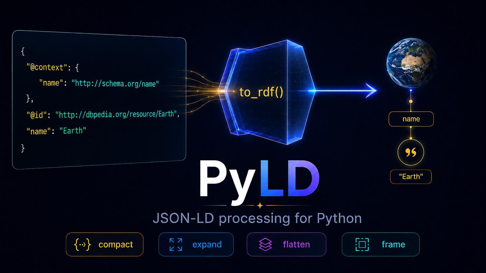

# :material-graph-outline: PyLD

PyLD is a Python implementation of the [JSON-LD](https://json-ld.org/) processor API.

JSON-LD is a lightweight syntax for expressing Linked Data in JSON. It lets
applications add meaning to existing JSON documents with in-band or out-of-band
contexts, while keeping the document shape practical for web APIs, JavaScript,
and JSON document stores.

{{ example('earth.py') }}

## :fontawesome-solid-people-line: Maintainers

-   

    __Miel Vander Sande__

    ---

    :fontawesome-brands-github:{ .middle } [`@mielvds`](https://github.com/mielvds)

-   

    __Anatoly Scherbakov__

    ---

    :fontawesome-brands-github:{ .middle } [`@anatoly-scherbakov`](https://github.com/anatoly-scherbakov)

