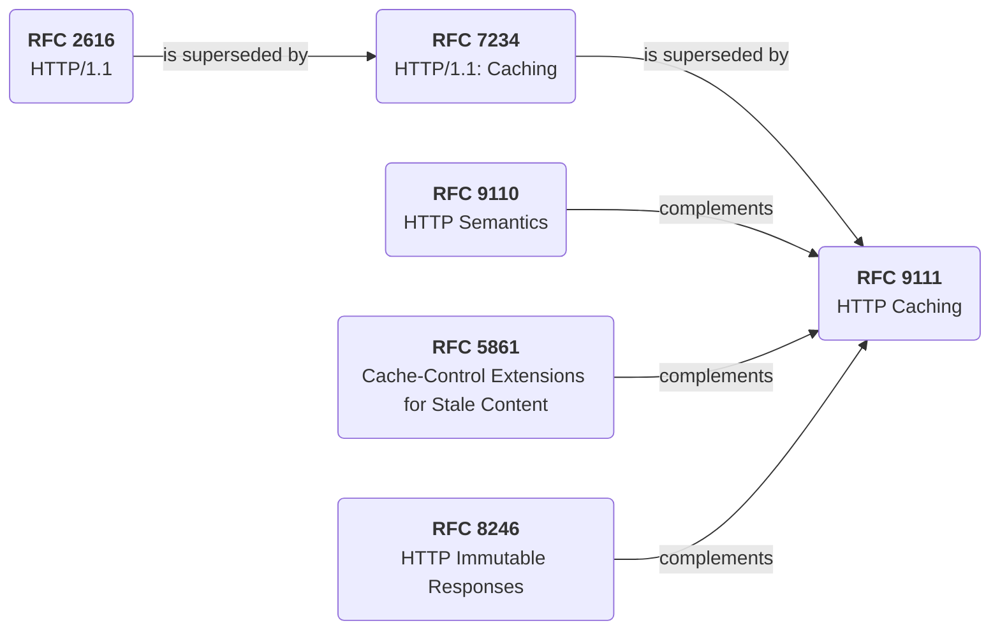

# Use `requests-cache` for persistent HTTP caching in synchronous Python code

{{ adr_metadata(date, status) }}

## :material-text-box-outline: Context

[:material-file-download-outline: PyLD document loaders](/pyld/reference/document-loaders/) fetch remote JSON-LD contexts and other documents over HTTP. [JSON-LD Best Practices](https://w3c.github.io/json-ld-bp/) recommends:

> **Best Practice 14:** Cache JSON-LD Contexts
>
> Services providing a JSON-LD Context *SHOULD* set HTTP cache-control headers to allow liberal caching of such contexts, and clients *SHOULD* attempt to use a locally cached version of these documents.
>
> — [§ 8.1 Cache JSON-LD Contexts](https://w3c.github.io/json-ld-bp/#cache-json-ld-contexts)

### Status Quo

PyLD already caches remote contexts in process memory only. [`ContextResolver`](https://github.com/digitalbazaar/pyld/blob/master/lib/pyld/context_resolver.py) shares a module-level [`LRUCache`](https://github.com/digitalbazaar/pyld/blob/master/lib/pyld/jsonld.py#L160-L162) of resolved contexts, and [`ResolvedContext`](https://github.com/digitalbazaar/pyld/blob/master/lib/pyld/resolved_context.py) keeps a per-document [`LRUCache`](https://github.com/digitalbazaar/pyld/blob/master/lib/pyld/resolved_context.py#L28) for processed contexts relative to an active context.

[`FrozenDocumentLoader`](/pyld/reference/document-loaders/frozen/) serves files from disk based on its configuration options set in code.

None of this is HTTP-aware or persistent across processes: [`RequestsDocumentLoader`](/pyld/reference/document-loaders/requests/) and [`AioHttpDocumentLoader`](/pyld/reference/document-loaders/aiohttp/) issue a fresh HTTP request on every load with no `Cache-Control` handling.

### HTTP Caching Standards

Client-side caching semantics are governed by the following standards:

This ADR compares Python HTTP caching libraries that could extend document loaders with standards-aware, persistent caching.

### Alternatives Rejected

| Library | HTTP-aware? | Persistent? |
|---------|:----------:|:----------:|
| [:fontawesome-brands-github: `tkem/cachetools`](https://github.com/tkem/cachetools) | :x: | :x: |
| [:fontawesome-brands-github: `grantjenks/python-diskcache`](https://github.com/grantjenks/python-diskcache) | :x: | :white_check_mark: |

Neither library implements HTTP cache semantics — `cachetools` is a generic in-memory structure and `diskcache` is persistent but not HTTP-aware — so they do not fit document-loader HTTP caching.

## :material-arrow-decision-outline: Decision

<table markdown="1">
  <tr markdown="span">
    <th></th>
    <th class="adr-col-included">[:fontawesome-brands-github: `requests-cache/requests-cache`](https://github.com/requests-cache/requests-cache)</th>
    <th class="adr-col-rejected">[:fontawesome-brands-github: `psf/cachecontrol`](https://github.com/psf/cachecontrol)</th>
    <th class="adr-col-undecided">[:fontawesome-brands-github: `requests-cache/aiohttp-client-cache`](https://github.com/requests-cache/aiohttp-client-cache)</th>
    <th class="adr-col-undecided">[:fontawesome-brands-github: `karpetrosyan/hishel`](https://github.com/karpetrosyan/hishel)</th>
  </tr>
  <tr markdown="span">
    <th colspan="5">Backend</th>
  </tr>
  <tr markdown="span">
    <th>[:fontawesome-brands-github: `psf/requests`](https://github.com/psf/requests)</th>
    <td class="adr-col-included">[:white_check_mark:](https://requests-cache.readthedocs.io/en/stable/#quickstart)</td>
    <td class="adr-col-rejected">[:white_check_mark:](https://cachecontrol.readthedocs.io/en/latest/usage.html#wrapper)</td>
    <td class="adr-col-undecided">[:x:](https://aiohttp-client-cache.readthedocs.io/en/stable/#aiohttp-client-cache)</td>
    <td class="adr-col-undecided">[:white_check_mark:](https://hishel.com/requests.html)</td>
  </tr>
  <tr markdown="span">
    <th>[:fontawesome-brands-github: `encode/httpx`](https://github.com/encode/httpx)</th>
    <td class="adr-col-included">[:x:](https://requests-cache.readthedocs.io/en/stable/#summary)</td>
    <td class="adr-col-rejected">[:x:](https://cachecontrol.readthedocs.io/en/latest/#welcome-to-cachecontrol-s-documentation)</td>
    <td class="adr-col-undecided">[:x:](https://aiohttp-client-cache.readthedocs.io/en/stable/#aiohttp-client-cache)</td>
    <td class="adr-col-undecided">[:white_check_mark:](https://hishel.com/quickstart.html#with-httpx)</td>
  </tr>
  <tr markdown="span">
    <th>[:fontawesome-brands-github: `aio-libs/aiohttp`](https://github.com/aio-libs/aiohttp)</th>
    <td class="adr-col-included">[:x:](https://requests-cache.readthedocs.io/en/stable/project_info/related_projects.html#client-side-http-caching)</td>
    <td class="adr-col-rejected">[:x:](https://cachecontrol.readthedocs.io/en/latest/#welcome-to-cachecontrol-s-documentation)</td>
    <td class="adr-col-undecided">[:white_check_mark:](https://aiohttp-client-cache.readthedocs.io/en/stable/#quickstart)</td>
    <td class="adr-col-undecided">[:x:](https://github.com/karpetrosyan/hishel#-features)</td>
  </tr>
  <tr markdown="span">
    <th colspan="5">HTTP Headers Support</th>
  </tr>
  <tr markdown="span">
    <th>`Cache-Control` request</th>
    <td class="adr-col-included">[Broad directive support.](https://requests-cache.readthedocs.io/en/stable/user_guide/headers.html#supported-headers)</td>
    <td class="adr-col-rejected">[`max-age`, `no-cache`, `no-store`, `min-fresh`; other directives parsed but not necessarily honored.](https://cachecontrol.readthedocs.io/en/latest/usage.html)</td>
    <td class="adr-col-undecided">[Simplified: `max-age`, `no-cache`, `no-store`.](https://aiohttp-client-cache.readthedocs.io/en/stable/user_guide.html#cache-control)</td>
    <td class="adr-col-undecided">[:white_check_mark:](https://www.rfc-editor.org/rfc/rfc9111.html#name-request-directives)</td>
  </tr>
  <tr markdown="span">
    <th>`Cache-Control` response</th>
    <td class="adr-col-included">[Broad directive support.](https://requests-cache.readthedocs.io/en/stable/user_guide/headers.html#supported-headers)</td>
    <td class="adr-col-rejected">[`max-age`, `no-store`, validator-driven caching.](https://cachecontrol.readthedocs.io/en/latest/etags.html)</td>
    <td class="adr-col-undecided">[Simplified: `max-age`, `no-store`.](https://aiohttp-client-cache.readthedocs.io/en/stable/user_guide.html#cache-control)</td>
    <td class="adr-col-undecided">[:white_check_mark:](https://www.rfc-editor.org/rfc/rfc9111.html#name-response-directives)</td>
  </tr>
  <tr markdown="span">
    <th>`Expires`</th>
    <td class="adr-col-included">[:white_check_mark:](https://requests-cache.readthedocs.io/en/stable/user_guide/headers.html#supported-headers)</td>
    <td class="adr-col-rejected">[:white_check_mark:](https://cachecontrol.readthedocs.io/en/latest/etags.html)</td>
    <td class="adr-col-undecided">[:white_check_mark:](https://aiohttp-client-cache.readthedocs.io/en/stable/user_guide.html#cache-control)</td>
    <td class="adr-col-undecided">[:white_check_mark:](https://www.rfc-editor.org/rfc/rfc9111.html#name-expires)</td>
  </tr>
  <tr markdown="span">
    <th>`ETag` / `If-None-Match`</th>
    <td class="adr-col-included">[:white_check_mark:](https://requests-cache.readthedocs.io/en/stable/user_guide/headers.html#supported-headers)</td>
    <td class="adr-col-rejected">[:white_check_mark:](https://cachecontrol.readthedocs.io/en/latest/etags.html)</td>
    <td class="adr-col-undecided">[:warning:](https://aiohttp-client-cache.readthedocs.io/en/stable/modules/aiohttp_client_cache.cache_control.html#aiohttp_client_cache.cache_control.compose_refresh_headers)</td>
    <td class="adr-col-undecided">[:white_check_mark:](https://www.rfc-editor.org/rfc/rfc9111.html#name-validation)</td>
  </tr>
  <tr markdown="span">
    <th>`Last-Modified` / `If-Modified-Since`</th>
    <td class="adr-col-included">[:white_check_mark:](https://requests-cache.readthedocs.io/en/stable/user_guide/headers.html#supported-headers)</td>
    <td class="adr-col-rejected">[:white_check_mark:](https://cachecontrol.readthedocs.io/en/latest/etags.html)</td>
    <td class="adr-col-undecided">[:warning:](https://aiohttp-client-cache.readthedocs.io/en/stable/modules/aiohttp_client_cache.cache_control.html#aiohttp_client_cache.cache_control.compose_refresh_headers)</td>
    <td class="adr-col-undecided">[:white_check_mark:](https://www.rfc-editor.org/rfc/rfc9111.html#name-validation)</td>
  </tr>
  <tr markdown="span">
    <th>`Vary`</th>
    <td class="adr-col-included">[:white_check_mark:](https://requests-cache.readthedocs.io/en/stable/user_guide/headers.html#supported-headers)</td>
    <td class="adr-col-rejected">[:white_check_mark:](https://github.com/psf/cachecontrol/blob/master/cachecontrol/serialize.py#L56-L66)</td>
    <td class="adr-col-undecided">[:x:](https://aiohttp-client-cache.readthedocs.io/en/stable/user_guide.html#cache-control)</td>
    <td class="adr-col-undecided">[:white_check_mark:](https://www.rfc-editor.org/rfc/rfc9111.html#name-calculating-cache-keys-with)</td>
  </tr>
  <tr markdown="span">
    <th colspan="5">Meta *(last updated: 28 June 2026)*</th>
  </tr>
  <tr markdown="span">
    <th>Last release</th>
    <td class="adr-col-included">[1.3.2](https://pypi.org/project/requests-cache/1.3.2/) <small>2026-05-11</small></td>
    <td class="adr-col-rejected">[0.14.4](https://pypi.org/project/CacheControl/0.14.4/) <small>2025-11-14</small></td>
    <td class="adr-col-undecided">[0.14.3](https://pypi.org/project/aiohttp-client-cache/0.14.3/) <small>2026-01-07</small></td>
    <td class="adr-col-undecided">[1.3.0](https://pypi.org/project/hishel/1.3.0/) <small>2026-06-11</small></td>
  </tr>
  <tr markdown="span">
    <th>GitHub Stars</th>
    <td class="adr-col-included">:star: [1,495](https://github.com/requests-cache/requests-cache/stargazers)</td>
    <td class="adr-col-rejected">:star: [499](https://github.com/psf/cachecontrol/stargazers)</td>
    <td class="adr-col-undecided">:star: [152](https://github.com/requests-cache/aiohttp-client-cache/stargazers)</td>
    <td class="adr-col-undecided">:star: [395](https://github.com/karpetrosyan/hishel/stargazers)</td>
  </tr>
  <tr markdown="span">
    <th>Decision</th>
    <td class="adr-col-included">:white_check_mark: Adopt as optional sync HTTP cache support for [`RequestsDocumentLoader`](/pyld/reference/document-loaders/requests/).</td>
    <td class="adr-col-rejected">:x: Exclude — shares the `requests` backend with `requests-cache`, but [defaults to an in-memory store](https://cachecontrol.readthedocs.io/en/latest/#quick-start) with no first-class persistent backend comparable to [`requests-cache` storage options](https://requests-cache.readthedocs.io/en/stable/user_guide/backends.html), offers narrower [`Cache-Control` directive support](https://cachecontrol.readthedocs.io/en/latest/usage.html), and trails on maintenance signals in this comparison.</td>
    <td class="adr-col-undecided">:question: Defer for async support to limit dependency and maintenance footprint; candidate if [`AioHttpDocumentLoader`](/pyld/reference/document-loaders/aiohttp/) gains HTTP caching.</td>
    <td class="adr-col-undecided">:question: Defer — strong HTTP cache policy design, but adoption would target [`httpx`](https://github.com/karpetrosyan/hishel#-features) rather than PyLD's current [`AioHttpDocumentLoader`](/pyld/reference/document-loaders/aiohttp/).</td>
  </tr>
</table>

:warning: marks indirect or limited support. `aiohttp-client-cache` has [conditional refresh support for validators](https://aiohttp-client-cache.readthedocs.io/en/stable/modules/aiohttp_client_cache.cache_control.html#aiohttp_client_cache.cache_control.compose_refresh_headers), but its own documentation describes cache-header handling as a [simplified subset](https://aiohttp-client-cache.readthedocs.io/en/stable/user_guide.html#cache-control) rather than full automatic validator-driven HTTP cache revalidation. For `hishel`, header rows link to the governing [RFC 9111](https://www.rfc-editor.org/rfc/rfc9111.html) sections because its default [`SpecificationPolicy`](https://hishel.com/policies) implements the full specification rather than documenting per-header support separately.

## :material-arrow-right-bold-outline: Consequences

- PyLD will add optional, HTTP-aware sync caching via `requests-cache` without making caching a required dependency.
- Opt-in sync caching will now be provided by [`SqliteCacheRequestsDocumentLoader`](/pyld/reference/document-loaders/sqlite-cache-requests/), composing `RequestsDocumentLoader` with a persistent SQLite `CachedSession`.
- A custom in-process HTTP cache implementation is rejected; with a fitting library available, PyLD will integrate `requests-cache` rather than expand the codebase to implement RFC 9111 caching itself.
- CacheControl is excluded for the sync `requests` path in favor of `requests-cache`.
- Async HTTP caching remains out of scope for this decision; `aiohttp-client-cache` and `hishel` stay as future candidates.
